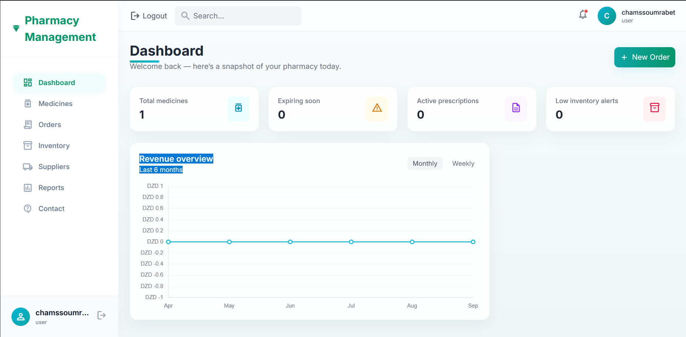
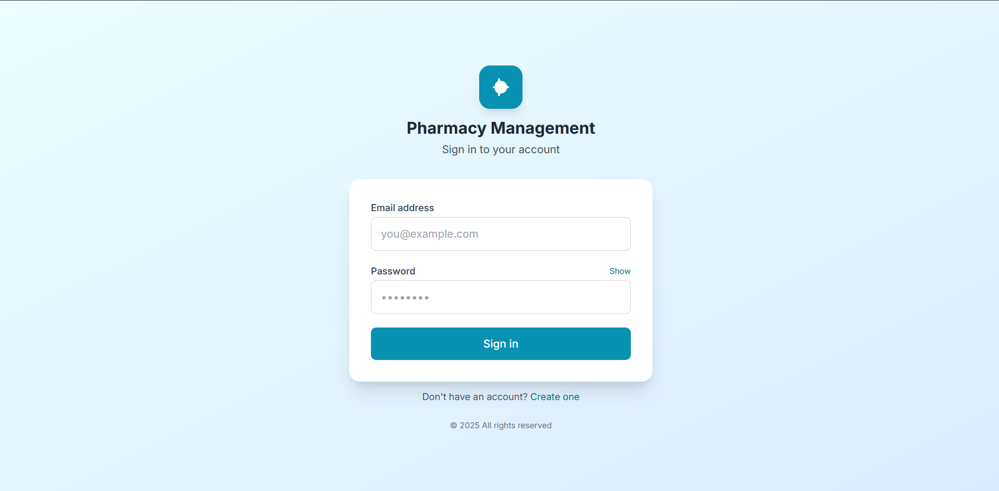
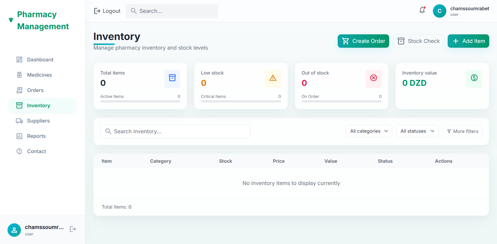
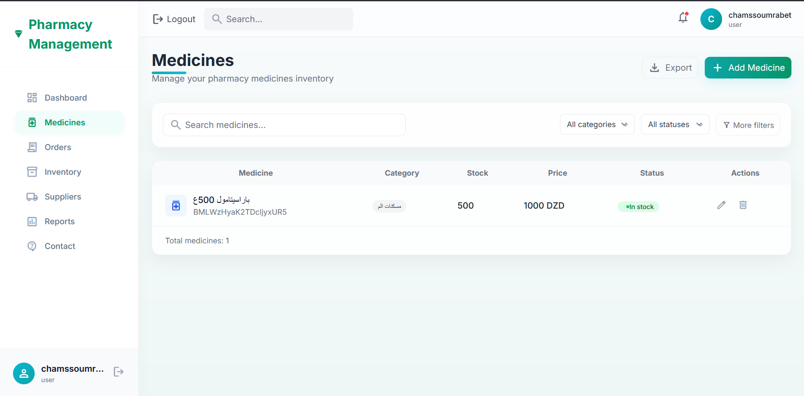
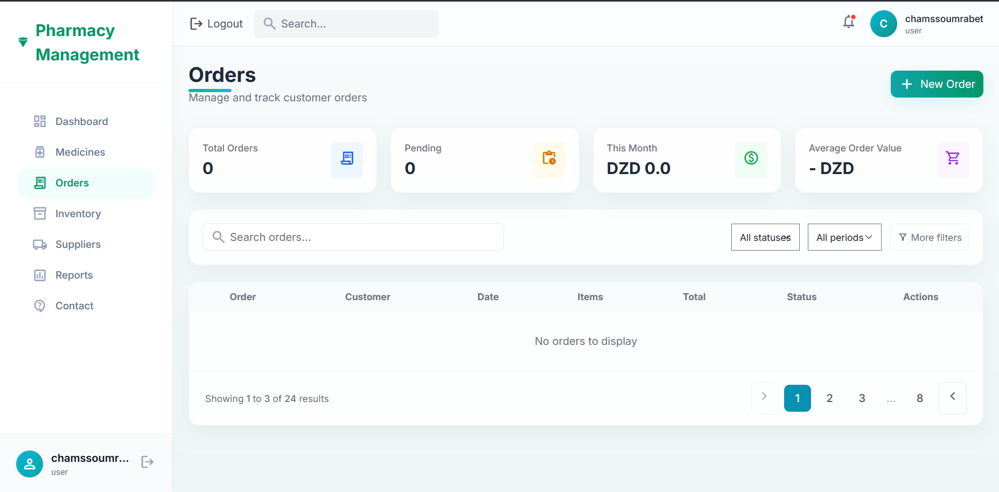
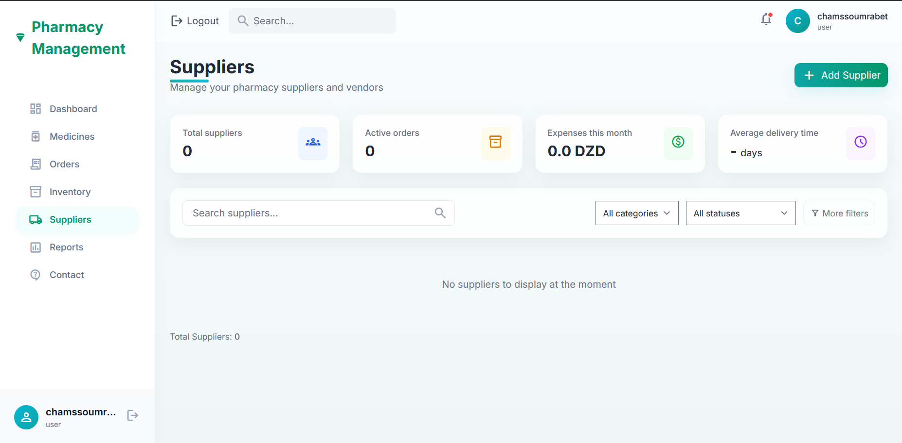
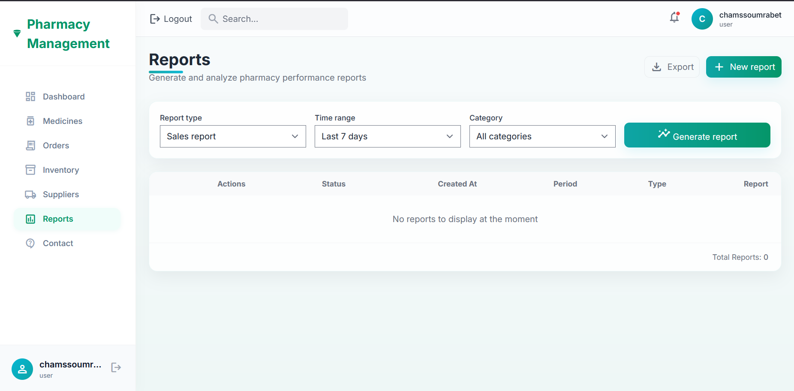
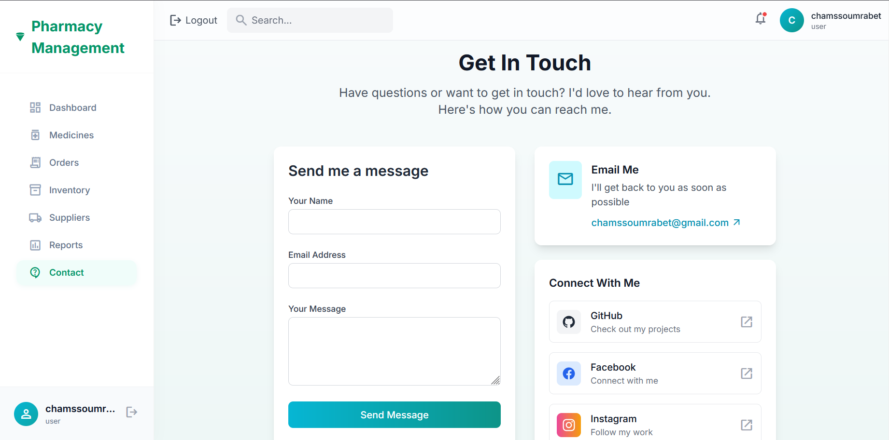

# (PharmaSys) - Modern Pharmacy Management System

[](LICENSE)
[](https://flask.palletsprojects.com/)
[](https://firebase.google.com/)

## 🚀 Project Overview

KicksUp (PharmaSys) is a comprehensive pharmacy management system built with Flask and Firebase. It provides a complete solution for managing pharmacy operations including inventory tracking, medicine management, prescription handling, order processing, and sales reporting.

## ✨ Key Features

- **📊 Dashboard Analytics** - Real-time insights into pharmacy operations with interactive charts
- **💊 Medicine Management** - Complete medicine database with expiry tracking
- **📋 Inventory Control** - Stock level monitoring with low inventory alerts
- **📝 Prescription Management** - Process and track patient prescriptions
- **🛒 Order Processing** - Create and manage customer orders with integrated billing
- **🏢 Supplier Management** - Maintain supplier information and purchase history
- **🌐 Multilingual Support** - Full support for English and Arabic languages
- **🔐 Secure Authentication** - Firebase-based user authentication with role management
- **☁️ Cloud Integration** - Firebase Firestore for reliable data storage

## 🛠️ Technical Stack

- **Backend**: Flask (Python 3.7+)
- **Database**: Firebase Firestore
- **Frontend**: HTML5, CSS3, JavaScript with Jinja2 templates
- **Authentication**: Firebase Authentication
- **Storage**: Google Cloud Storage (optional)

## 📦 Installation & Setup

### Prerequisites
- Python 3.7 or higher
- Firebase project (optional, for production use)
- Git

### Local Development Setup

1. **Clone the repository**
   ```bash
   git clone https://github.com/DAVIXSX/pharmacy-management-system.git
   cd pharmacy-management-system
   ```

2. **Create and activate virtual environment**
   ```powershell
   # Windows PowerShell
   python -m venv .venv
   .\.venv\Scripts\Activate
   ```
   ```bash
   # Linux/macOS
   python -m venv .venv
   source .venv/bin/activate
   ```

3. **Install dependencies**
   ```bash
   pip install -r requirements.txt
   ```

4. **Configure Firebase (Optional)**
   - Create a Firebase project at [Firebase Console](https://console.firebase.google.com/)
   - Enable Firestore Database
   - Create a service account and download the JSON key
   - Set environment variable:
   
   ```powershell
   # Windows PowerShell
   $env:GOOGLE_APPLICATION_CREDENTIALS = 'C:\path\to\serviceAccount.json'
   ```
   ```bash
   # Linux/macOS
   export GOOGLE_APPLICATION_CREDENTIALS='/path/to/serviceAccount.json'
   ```
   
   **Note**: If no Firebase credentials are provided, the app will use mock data for development.

5. **Run the application**
   ```bash
   python app.py
   ```
   
6. **Access the application**
   Open your browser and navigate to `http://127.0.0.1:5000`

## 🗂️ Project Structure

```
kicksup/
├── app.py                    # Main Flask application
├── firebase_config.py        # Firebase configuration
├── firebase_client.py        # Firebase client utilities
├── translations.py           # Multilingual support
├── templates/               # HTML templates
│   ├── base.html           # Base template
│   ├── login.html          # Authentication pages
│   ├── index.html          # Dashboard
│   ├── inventory.html      # Inventory management
│   ├── medicines.html      # Medicine database
│   ├── orders.html         # Order management
│   └── ...                 # Other templates
├── static/                 # Static assets (CSS, JS, images)
├── requirements.txt        # Python dependencies
└── README.md              # This file
```

## 📱 Screenshots

### Dashboard Analytics

*Real-time pharmacy analytics with interactive charts and key performance metrics*

### Login & Authentication

*Secure Firebase-based authentication system*

### Inventory Management

*Comprehensive inventory tracking with low stock alerts*

### Medicine Database

*Complete medicine catalog with expiry date monitoring*

### Order Processing

*Streamlined order management and billing system*

### Supplier Management

*Maintain supplier relationships and purchase history*

### Business Reports

*Generate comprehensive business insights and reports*

### Contact & Support

*Integrated support and communication features*

## 🎯 Usage

1. **Login/Register**: Create an account or login with existing credentials
2. **Dashboard**: View pharmacy performance metrics and analytics
3. **Inventory**: Manage stock levels and receive low inventory alerts
4. **Medicines**: Add, edit, and track medicine information and expiry dates
5. **Orders**: Process customer orders and manage billing
6. **Suppliers**: Maintain supplier relationships and purchase history
7. **Reports**: Generate comprehensive business reports

## 📚 Documentation & Support

- **Templates**: Located in `templates/` directory, using Jinja2 templating
- **Static Files**: CSS, JavaScript, and images in `static/` directory
- **Database**: Uses Firebase Firestore with automatic fallback to mock data
- **Authentication**: Integrated Firebase Authentication with session management

## 🤝 Contributing

Contributions are welcome! Please feel free to submit a Pull Request. For major changes:

1. Fork the repository
2. Create your feature branch (`git checkout -b feature/AmazingFeature`)
3. Commit your changes (`git commit -m 'Add some AmazingFeature'`)
4. Push to the branch (`git push origin feature/AmazingFeature`)
5. Open a Pull Request

## 📝 License

This project is licensed under the MIT License - see the [LICENSE](LICENSE) file for details.

## 📞 Contact

📧 Email: [nexgendev.davis@gmail.com](mailto:nexgendev.davis@gmail.com)

---

**Built with ❤️ for pharmacy management**
